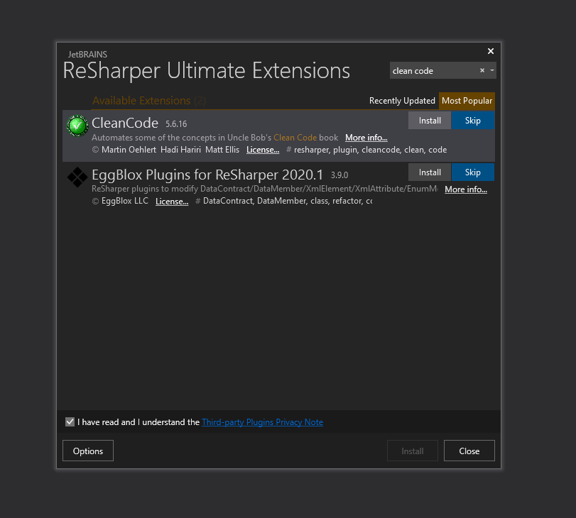

## Styleguide

Za pisanje C# koda, koristicemo Microsoft style guide.
Vise informacija mozete videti ovde: [style guide](https://docs.microsoft.com/en-us/dotnet/csharp/programming-guide/inside-a-program/coding-conventions).

Instaliranje ReSharpera zahteva studentsku licensku koju mozete dobiti prijavom na ovaj [sajt](https://www.jetbrains.com/community/education/#students)

Nakon instaliranog ReSharp-era mozete dodati i Clean Code linter instalirajuci odgovarajucu ekstenziju:


## Testiranje

Praticemo Microsoft guide za TDD. Vise informacija mozete videti [ovde](https://docs.microsoft.com/en-us/visualstudio/test/quick-start-test-driven-development-with-test-explorer?view=vs-2019)

## Git style guide

Za stvaranje novih branch-ova koristimo npr. za user story: "Add ability to login" i servis "Director"

```bash
    git commit -m "Add Login Ability"
    git commit -m <USER-STORY>
```
  
```bash
    git checkout -b add-login-feature/director
    git checkout -b <GLAGOL>-<KEYWORD>-feature/<ROLE>
```
  
Branch za poseban servis npr. "Patient" bice:
  
```bash
    git checkout -b patient
```

## TODO

- [ ] Upravnik se dodaje od iz .env file
- [ ] Mozemo Sekretare dodavati takodje iz .env file
- [ ] Doktor termini vise na vise
- [ ] Pacijent moze da zakaze kod opste prakse
- [ ] Sekretar može da poveže neki guest sa pravim nalogom. Tj. ako pacijent odluči da ipak želi da napravi nalog onda može istorija pregleda da se učita sa prethodnog gesta
- [ ] Guest nalog je povezan sa JMBG i brojem licne karte/zdravstvene knjizice, Claimuje podatke
- [ ] Pacijent ukida terminu unutar 24h ( u intervalu od 24h ) preko Sekretara 
- [ ] Zajednicki Use Case za slanje zahteva?
- [ ] Lekar -> Lekar Specijalista
- [ ] Premestanje termina - Sekretar
- [ ] Sekretar ne mora da odobrava termin -> Termin u timetable
- [ ] Moguće je zakazati renoviranje za salu ako je prva sledeća operacija najranije 15(var) dana od trenutka kada se želi zakazati renoviranje.
- [ ] Mogu biti konsultacije sa drugim lekarom ali se vodi kao zakazan termin za drugog lekara
- [ ] Guest nalog ima samo neophodne podatke 
- [ ] Extend za specijaliste -> u Use Case
- [ ] Da li izdvojiti pretrage kao Use Casove - Upravnik
- [ ] Wireframe ( KLM )
- [ ] Class diagram
- [ ] Medju tabela Lek , Oprema, Room
- [ ] Guess nalog


## Pitanja za konsultacije


- [ ] Pojasnjenje za magacin i registraciju novih lekova
- [ ] Da li svi dele isti Login view i kasnije preusmerenje na razlicite preglede ( Zaposleni ili Pacijenti )
- [ ] Handlovanje eventa za izvestaje ( Da li mora da klasa Izvestaj da se sadrzi u nekom modelu ( Direktor , Lekar itd.))
- [ ] Da li Upravnik registruje Sekretara ( screenshot )
- [ ] Lista svih renovacija kod Upravnika ili mozemo da pokupimo iz svih soba
- [ ] Zakazivanje sala inicira Doktor?

## Odgovori

- [x] Koji specijalizacije doktora postoje?
- [x] Koje vrste zaposlenih postoje?
- [x] Koji zaposleni uvek moraju da budu na raspolaganju?
- [x] Da li sve specijalizacije moraju postojati u bolnici? Kako se zakazuje ako je potreban specijalista koji ne postoji u bolnici?
- [x] Specijalizovani doktori mogu izdavati dalje upute (snimanja npr.)?
- [x] Sta moze specijalista da radi? Da li opsta praksa moze jos nesto pored izdavanja uputa i zakazivanja operacija?
- [x] Razlika izmedju kartona i medicinske istorije?  
- [x] Soba ima neophodne iteme?
- Da. Lekovi se gledaju globalno 
- [x] Prioritet pacijenta; Termin ili lekar?
- Bira izmedju prioriteta
- [x] Slucaj ako pacijent izabere vise doktora za trazenje termina?
- Bira izmedju prioriteta
- [x] Da li pacijent moze da zakaze pregled samo kod izabranog lekara? Koja je uopste razlika izmedju izabranog lekara i bilo ko drugog?
- Ne postoji izabran lekar
- [x] Ko ima pristup zdravstvenom kartonu konkretnog pacijenta?
- Svako ko je vrsio pregled lekara i zadao dijagnozu ili operaciju
- [x] #33 Zar je zaista potrebno?
- Jeste
- [x] Ko sve koristi operacione sale
- [x] #22 Da li je potrebno da vidi sve pacijente i koje informacije ima PRAVO da vidi - Sekretar i Upravnik
- Moze
- [x] #18 Tokom renoviranja, da li mogu da se menja broj i vrste soba
- Moze, pregradjivanje i rusenje
- [x] #6 CRUD za sve zaposlene
- Da
- [x] Da li da omogucimo lekarima da isprave opis leka?
- Moze ali ne mora
- [x] Da li Upravnik moze da prebaci lekove i opreme iz jedne sobe u drugu, ili mora preko Magacina
- Ne moze iz jedne sobe u drugu
- [x] Da li postoji ogranicenje na to gde oprema i lekovi mogu da budu?
- Samo neophodna oprema za datu vrstu sobe moze da postoji u njoj
- [x] Nikola - Da li Upravnik moze da menja duzine termina pregleda?
- Upravnik nema tu mogucnost
- [x] Dusan  - Duzina termina kod lekara, fiksna ili ne?
- Nije fiksna, u .env ide za svaku vrstu lekara posebno
- [x] Dusan  - Kako se zapisiju alternativni tokovi ako imam extends/include u Use Cases? Gde u glavnom toku upisujemo da prelazi na extends/include drugi Use Case?
- UseCase.pdf
- [x] Dusan  - Kako predstaviti grananja u Use Case-u? Npr. U zavisnosti od toga da li je pacijent izabrao lekara ili termin kao prioritet postoji grananje kada je izabrao lekara i druga grana kada izabere termin? Da li se jedan od njih vodi kao alternativni tok? 
- [x] Dusan  - Da li postoji magacin u kome se nalazi oprema i lekovi ili se sve odmah dodeljuje sobama/bolnici?
-  Zamislite da ima magacin i na nivou magacina/bolnice kolicinu svega. Ne moramo se baviti kolicinama lekova na nivou sobu.
- [x] Dusan  - Da li se pacijenti snabdevaju prepisanim lekovima iz naseg Magacina ili to radi neki treci cinioc van naseg sistema (npr. tip entiteta apoteka)?
- Pacijenti nisu snabdevani lekovima sa recepta
- [x] Dusan  - Da li se odobrava koriscenje operacionih sala (operacije) od strane sekretara
- Ne
- [x] Dusan  - Koji sve izvestaji postoje i koje sve statistike treba prikazati?(Magacin, Sobe, Lekovi, Oprema, Pacijenti)
- Zauzece prostorija, Osovlja u nekom periodu, Sekretara najvise zanima raspored, zatim pacijenta mozda koliko puta je vio koliko je imao operacija koliko puta je otkazao pregled i slicno, A lekare koliko je pacijenata pregledao u nekom periodu koliko je imao operacija koliko je kog leka izdao i slicno
- [x] Dusan  - Tok nabavke lekova i opreme? Sta Upravnik dodeljuje na zahtev, a sta sam odlucuje o raspodeli?
- Upravnik vidi neki minimum u opremi -> salje zahtev za opremu/lek. 
- [x] Dusan  - Tok registrovanja novog leka? Ko zahteva? Ko odobrava? Kada se javlja potreba za registrovanjem?
- Lek dodje u magacin -> Upravnik unosi u sistem
- [x] Dusan  - Pacijent ima pristup sopstvenoj istoriji lecenja?
- Pregled svih buducih i prethodnih pregleda
- [x] Dusan  - Doktor ima uvid svih poslanih zahteva za dodatnim lekom/opremom sa njegove strane?
- To sami osmislite
- [x] Dusan  - Doktor zahteva lekove/opremu?
- Opremom i lekovima upravlja Upravnik kada dodje do minimumu
- [x] Dusan  - Kako odredjujemo kompatibilnost sobe sa lekarom i opremom/lekovima? 
- Pravimo razliku izmedju kancelarije i operacione sale
